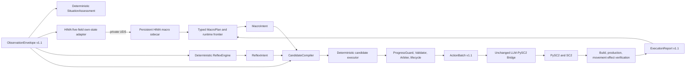
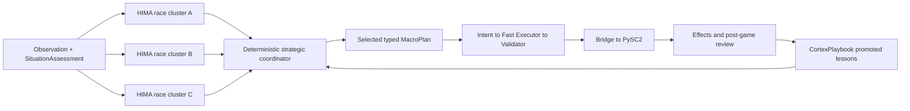

# Architecture overview

RTSCortex separates the StarCraft II environment worker from the agent runtime so each
process can use an appropriate Python and dependency set. Two runtime profiles share the
same environment boundary:

- the original modular Runtime uses Memory, Reflection, Planning, and Action modules;
- the SC2-native Cortex profile uses a specialist macro policy plus deterministic,
  observation-bound execution.

```text
LLM-PySC2 worker -- ObservationEnvelope --> Runtime
Runtime fast path: Reflex -----------------> Arbiter
Runtime slow path: Memory -> Reflection -> Planning -> Action -> Arbiter
Arbiter -- validated ActionBatch ----------> LLM-PySC2 translator
```

The original module chain remains available for existing experiment variants. Selecting
`agent.variant: cortex` changes decision ownership inside the Runtime; it does not change
the Worker API, the LLM-PySC2 translator, or PySC2 execution semantics.

## SC2-native Cortex v0.3

The v0.3 vertical slice gives game knowledge and low-level execution different owners.
A HIMA specialist proposes an ordered Protoss macro policy, while deterministic components interpret
the current observation, handle urgent reactions, and choose only from exact executable
candidates.



### Role ownership

| Role | Current owner | Input and output | Dispatch authority |
|---|---|---|---|
| Situation | `DeterministicSituationAnalyzer` | Full current observation to a typed phase, threat, economy, and army assessment | None |
| Macro | Persistent HIMA Protoss sidecar | Exact five-field own-state snapshot to a parsed and versioned `MacroPlan` | None |
| Tactical | `DeterministicTacticalAgent` | Visible enemies, army readiness, health, and legal combat actors to focus-fire, reacquisition, advance, or retreat intents | None |
| Reflex | `ReflexEngine` | Current alerts, enemies, and unit state to a `ReflexIntent` | None |
| Fast executor | `DeterministicCandidateExecutor` | Observation-bound candidates to one selection or an explicit abstention | None |
| Safety and dispatch | Cortex Runtime | Intent selection through ProgressGuard, Validator, Arbiter, and command lifecycle to `ActionBatch` | Sole Runtime dispatch path |
| Environment and effects | LLM-PySC2 Bridge | `ActionBatch` to translator primitives, PySC2 acceptance, and target-matched effect evidence | Sole SC2 execution path |

The HIMA sidecar receives only `supply_used`, `supply_capacity`, completed own `unit`
counts, completed `research`, and recent confirmed `previous_action` values. It does not
receive enemy units, map coordinates, Runtime actor scopes, `GoalProgressReport`, legal
argument candidates, or the v1.1 command protocol. It therefore cannot choose a unit tag,
screen position, or directly dispatch an action.

HIMA output is parsed against its pinned 60-action Protoss vocabulary and projected into
the currently mapped RTSCortex macro actions. Managed Probe production is transparent;
unsupported dependencies and parse errors block the frontier instead of being skipped.
Only a frontier classified as `mapped_legal_now` can become a `MacroIntent`. Two bounded
liveness exceptions may select a later `mapped_legal_now` step from the same plan: a Pylon
can preempt a deferred frontier during a supply emergency, gas-blocked technology can yield
to Zealot, low-supply Pylon, or Nexus, and an unavailable third main-base Assimilator can
yield to the plan's legal expansion. Redundant Pylon steps are consumed and the next frontier
is evaluated in the same tick. Every fallback still passes through the same current candidate
domain and safety chain.

### Candidate-bound motor path

`CandidateCompiler` rebuilds actors and complete argument tuples from the current
`ObservationEnvelope.available_actions`. Each candidate is hashed together with the
observation and intent identity. The deterministic executor ranks goal-advancing actions
first and then uses stable action, actor, and argument order. Materialization rejects a
selection that is absent from the candidate set or bound to a stale observation. The
result still passes through the existing ProgressGuard, Validator, Arbiter, action budget,
actor-busy checks, TTL, and persistent command lifecycle before dispatch.

Reflex commands use this same candidate-bound path. A Reflex policy can propose an urgent
semantic action, but it cannot bypass current action availability or the existing safety
chain.

### Specialist process and failure boundary

The HIMA checkpoint runs once per live run in a separate process and is reached only through
a run-scoped Unix-domain socket. The sidecar loads one exact local Hugging Face snapshot,
serves serialized proposal requests, and reports its model ID, pinned revision, adapter,
parser, and vocabulary versions before the Runtime accepts it. Both
`HF_HUB_OFFLINE=1`/`TRANSFORMERS_OFFLINE=1` and Transformers
`local_files_only=True` are enforced; live startup never downloads a checkpoint.

When `required: true`, a missing executable, unacknowledged weight license, incorrect
snapshot revision, load failure, or health mismatch fails closed. With `required: false`,
the same startup failure is recorded and deterministic Reflex remains available. A
semantic parse, mapping, or unusable-frontier failure produces only
`macro_plan_rejected` and requests a new plan; `specialist_failed` is reserved for process,
transport, timeout, and inference failures. A timed-out generation immediately suspends
further macro requests because a cancelled Python waiter cannot safely prove that GPU
inference stopped. When a process owner
is available and the configured `restart_limit` has not been exhausted, Runtime terminates
and restarts the sidecar, repeats the exact health/provenance check, and resumes urgent
planning. Without a sidecar owner, or after the limit is exhausted, it remains suspended.

### Current scope boundary

Implemented in v0.3:

- deterministic situation assessment on every observation;
- persistent local HIMA Protoss-a/b/c transport with exact checkpoint provenance;
- HIMA macro-plan projection, dependency-safe Runtime frontier, measurable goal progress,
  and successful-action feedback over the most recent 60 game seconds;
- deterministic Reflex intents and deterministic observation-bound candidate selection;
- bounded supply/resource frontier fallbacks, deterministic gas-worker rebalance, placement
  deduplication/resampling, and timeout recovery;
- durable plan, intent, candidate, selection, lineage, lifecycle, execution, and effect
  events suitable for reports and the Live Console;
- a privacy-minimized executor corpus exporter, deterministic split verifier, and
  saved-candidate benchmark for preparing a future learned motor policy.

Not implemented in v0.3:

- a learned or SC2-specialized tactical subagent;
- a learned tiny motor/executor model, checkpoint loader, or SFT/RL training;
- model routing, ensembles, quantization, CPU/GPU offload, or automatic GPU selection;
- StarWM prediction, VLM perception, or air-unit special-ability micro.

The checked-in live canary targets HIMA Protoss-a. The configuration schema and process
identity checks also support Protoss-b/c, but those candidates require their own exact local
snapshot and independent live acceptance run.

## Race Brain Ensemble and CortexPlaybook v0.4

HIMA does not publish a separate all-race strategic-planner checkpoint. Its released model
family contains three specialist clusters for each race, while the upstream strategic
planner is a general language-model coordinator. RTSCortex v0.4 therefore keeps SC2-trained
knowledge in the three checkpoints for the active race and uses a deterministic,
environment-aware coordinator instead of allowing one cluster to impersonate the whole
race brain.



All three members receive the same pinned five-field HIMA projection. Members assigned to
the same device generate in stable `a`, `b`, `c` order, while independent device groups run
concurrently. The coordinator restores canonical `a`, `b`, `c` result order before scoring
each proposal by current Runtime frontier classification, current threat, ordered plan
depth, and matching promoted Playbook lessons.
It records every proposal, score, selection reason, checkpoint revision, and cited lesson ID
in `race_brain_coordinated`; only the selected proposal enters the unchanged safety and
dispatch path. Playbook data never changes HIMA's upstream input contract.

The coordination event also records `valid_member_count` and `degraded_member_ids`. A
checkpoint that emits an unknown action token remains visible as a degraded member, but it
cannot outrank another member with a valid Runtime frontier. RTSCortex does not guess a
mapping for model-specific placeholders such as `supply:12` or skip an invalid earlier step.

The public race-brain catalog covers the nine released HIMA checkpoints: Protoss, Terran,
and Zerg `a/b/c`. The active `RaceProfile` now supplies each race's HIMA observation contract,
macro mapping, actor routing, prerequisites, and effect semantics, so all three ensembles can
dispatch through the shared Cortex runtime. Only the configured player race is loaded.

CortexPlaybook is a separate cross-run SQLite database. Post-game review stores macro and tactical
decision with source run, command lineage, effect evidence, consequence, failure owner, and
confidence. Repeated engineering failures can become `execution_guard` rules, while outcome-backed
recommendations and repeated blocked frontiers become `strategy` rules. Execution guards never
boost or penalize a HIMA proposal; they preserve an explicit precondition for the executor and
Bridge. A positive strategy lesson is promoted only after the
same race, opponent, phase, and semantic action has produced a verified effect in at least
two winning episodes. Every rule signature counts distinct episodes, candidate rules stay hidden
by default, statement length is bounded, and retrieval returns only the configured top-k rules.
Strategy retrieval requires exact race and opponent; global execution guards require exact race.
This keeps the notebook iterative without allowing repeated copies from one game to dominate it.

The durable v0.4 observability events are `race_brain_coordinated`, `playbook_retrieved`,
`playbook_case_recorded`, `playbook_lesson_candidate`, `playbook_lesson_promoted`, and
`postgame_review_completed`. They use the existing EventStore/WebSocket path and are visible
in Live Console without opening a second control interface.

The canonical `SC2State` contains economy, production queue, own units, own structures,
and visible enemies. This is sufficient for the v0.1 runtime and deliberately matches the
semantic boundary needed by a future action-conditioned world model.

## Timing model

- Reflex policies run synchronously on every observation.
- The legacy Planner and the Cortex macro specialist both run single-flight in the
  background on a fixed start game-loop cadence.
- The last valid plan remains active while a new plan is pending.
- A macro plan's TTL starts at its acceptance game loop. Model inference and observation gaps
  are retained as provenance (`proposal_source_game_loop` and `acceptance_delay_game_loops`)
  but cannot make a newly accepted plan arrive already expired.
- `ActionBatch.planner_pending` lets a simulation worker pace game steps for a slower
  local model without blocking the runtime's reflex and fallback path.
- Reflex commands can preempt only commands for the same actor scope.
- Every command has a priority, source, acceptance loop, Runtime-owned TTL, and persistent
  lifecycle. A dispatched command ID is never returned a second time, including after a
  Runtime restart.
- Planner context contains a compact snapshot of every active `pending`, `deferred`, and
  `dispatched` command. Accepting an equivalent plan retains the existing command ID instead
  of refreshing its TTL or creating another dispatch.
- If an action reaches a terminal outcome while a specialist request is running, the
  returned proposal is rebuilt and revalidated against the latest observation. It is
  accepted only when the current Runtime frontier remains legal; state changes no longer
  force an otherwise valid three-model proposal to be discarded.
- Each actor has at most one in-flight dispatched command. Planner work for a busy actor is
  deferred, and Reflex work is suppressed until that command reaches one terminal report.
- Multiple Planner commands for one actor remain ordered in lifecycle state; the Runtime
  dispatches only the first and defers the rest until the actor is released.
- A decision with no legal command uses `commands=[]` plus a typed `idle_reason`; semantic
  `No_Operation` commands never enter command lifecycle or execution metrics.

## Live process lifecycle

For `environment.adapter: llm_pysc2`, the Python 3.11 CLI owns both sides of the live
episode. The original Runtime uses two processes: core Runtime and the isolated Python 3.9
Worker. A Cortex/HIMA run uses three: core Runtime, HIMA sidecar, and Worker. The supervisor
loads and health-checks HIMA first, starts a per-run Runtime Unix-socket API, waits for
`/healthz`, and only then launches the Worker. Runtime and policy sockets are distinct.
Normal completion, worker failure, and cancellation terminate owned processes, stop the
APIs, remove sockets, and close the runtime store.

The worker must report `EpisodeResult` through `/v1/episode/end`. If it exits first, the
supervisor records a synthetic `truncated` result for exit status zero or an `error` result
for a non-zero status, so incomplete live runs remain visible in evaluation artifacts.

## Live Console observability path

The optional Live Console is a read-only branch from the live process, not part of the
control loop:

```text
LLM-PySC2 worker -- control JSON over UDS --> Runtime API
        |                                      |
        | latest RGB JPEG over UDS             | durable events
        v                                      v
   bounded frame queue -----------------> LiveConsoleHub
                                               |
                                  loopback HTTP/WebSocket
                                               v
                                      React Live Console
```

When enabled, the Worker encodes agent-visible RGB observations on a background thread.
Its queue holds at most one pending frame, and the Hub retains only the latest screen and
minimap in memory. Durable decision events remain in SQLite and JSONL, allowing a browser
to backfill after reconnect; RGB frames are intentionally neither backfilled nor written to
disk. The browser server binds to `127.0.0.1` and exposes only `/console/api/v1` read APIs.
Tick, execution, episode, and frame-ingest requests remain private to the Unix socket.

When disabled, RTSCortex does not request RGB planes, start the encoder or Hub, or bind a
browser port. Console failure and slow or disconnected browsers cannot block the Worker or
terminate the SC2 episode.

Cortex adds `situation_assessed`, `macro_plan_accepted`/`macro_plan_rejected`,
`intent_emitted`, `candidate_set_built`, `executor_selection`, `command_lineage`, and
`specialist_ready`/`specialist_failed`/`specialist_recovered` plus
`macro_frontier_preempted` to the durable event stream. `command_lineage`
joins a dispatched wire command back through candidate, selection, intent, source specialist,
and macro plan. The report calculates candidate-domain violations, executor latency, and
missing/orphan lineage counts; the Console presents the same chain without requiring the
raw JSON to be read.

## Safety boundary

Model responses are parsed into typed proposals. Every target or position action must select
a complete argument tuple from the current structured candidate domain. Only validated
`ActionCommand` objects can cross the environment boundary. Unknown actions,
candidate-external arguments, invalid actor scopes, expired commands, and commands exceeding
the action budget are recorded and rejected. `Attack_Unit` is additionally enemy-only at
extraction, schema, Runtime, and upstream alliance-validation layers.

The live Bridge records every translator primitive with command provenance and distinguishes
orchestration actions (camera and selection) from the final translated primitive. A command
can have exactly one terminal execution report. Build commands are confirmed only when a new
structure tag of the expected type appears near that command's resolved target; resource
changes and worker orders are diagnostic evidence, not success criteria.

Training commands likewise remain pending after PySC2 acceptance until the exact production
building shows the expected raw order or a target unit appears as one-to-one fallback evidence.
The Cortex profile reuses these v1.1 Bridge, build, production, and movement verifiers without
changing their success semantics.

## Research provenance

- [LLM-PySC2](https://github.com/NKAI-Decision-Team/LLM-PySC2) supplies the environment
  and structured action basis.
- [Orak](https://github.com/krafton-ai/Orak) informs the modular planning, reflection,
  memory, and evaluation flow; RTSCortex reimplements those concepts with typed contracts.
- [SwarmBrain](https://arxiv.org/abs/2401.17749) motivates the split between slow LLM
  strategy and fast deterministic reflexes.
- [StarWM](https://github.com/yxzzhang/StarWM) and
  [VLM-Play-StarCraft2](https://github.com/camel-ai/VLM-Play-StarCraft2) are future plugin
  targets and are not runtime dependencies in v0.1.
